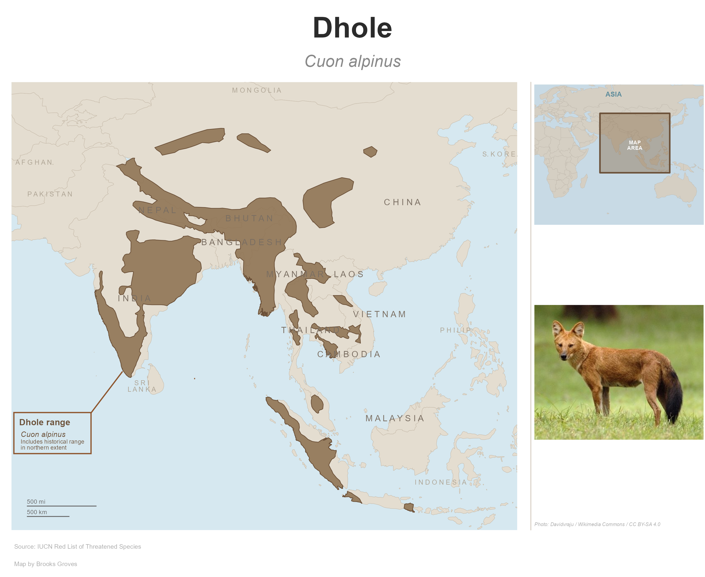
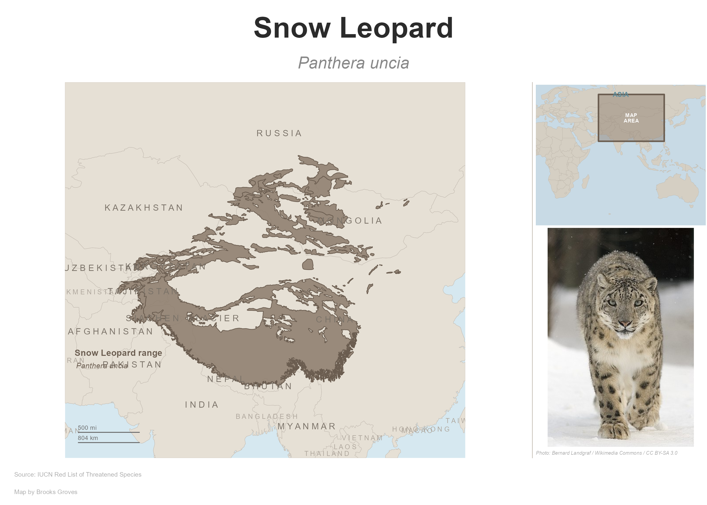
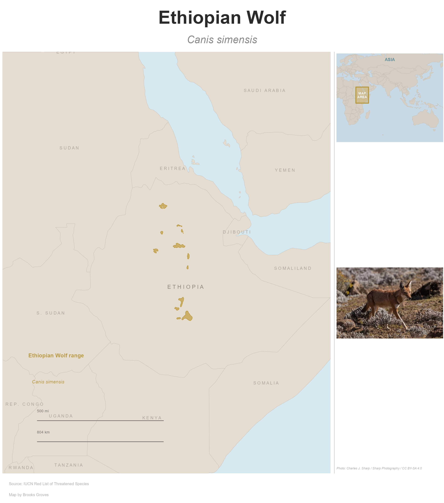
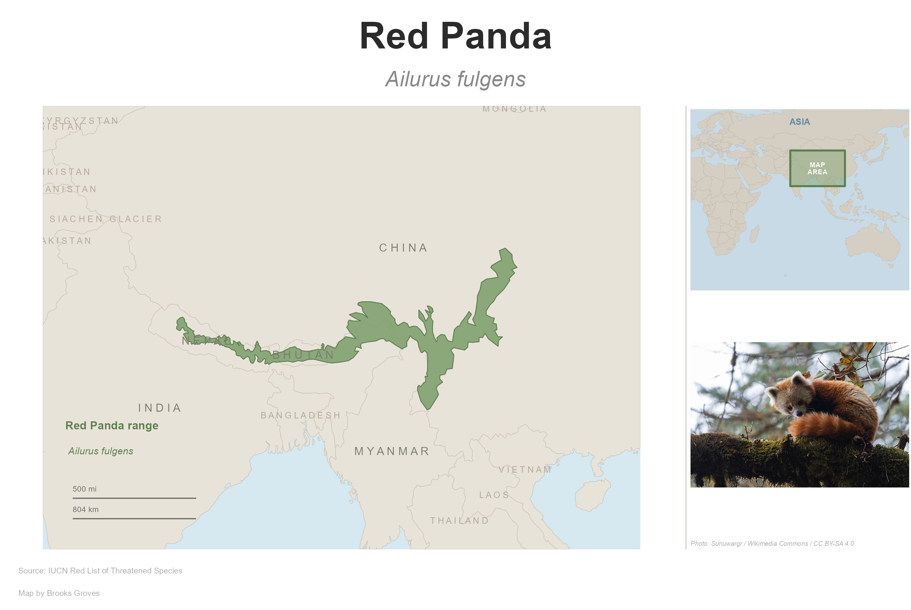
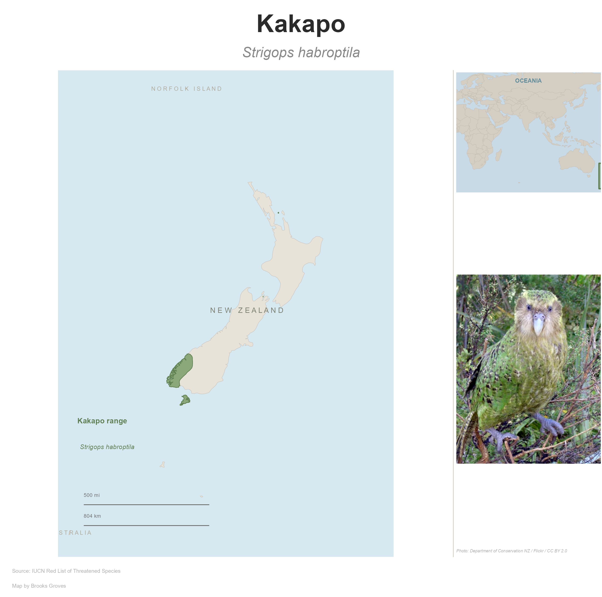
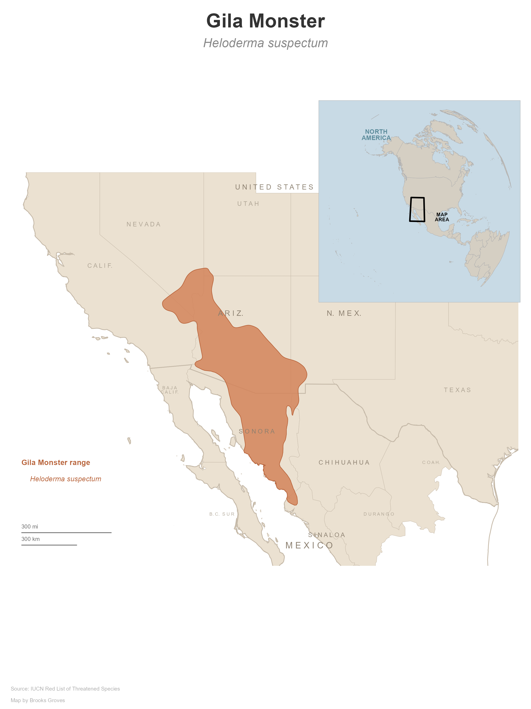
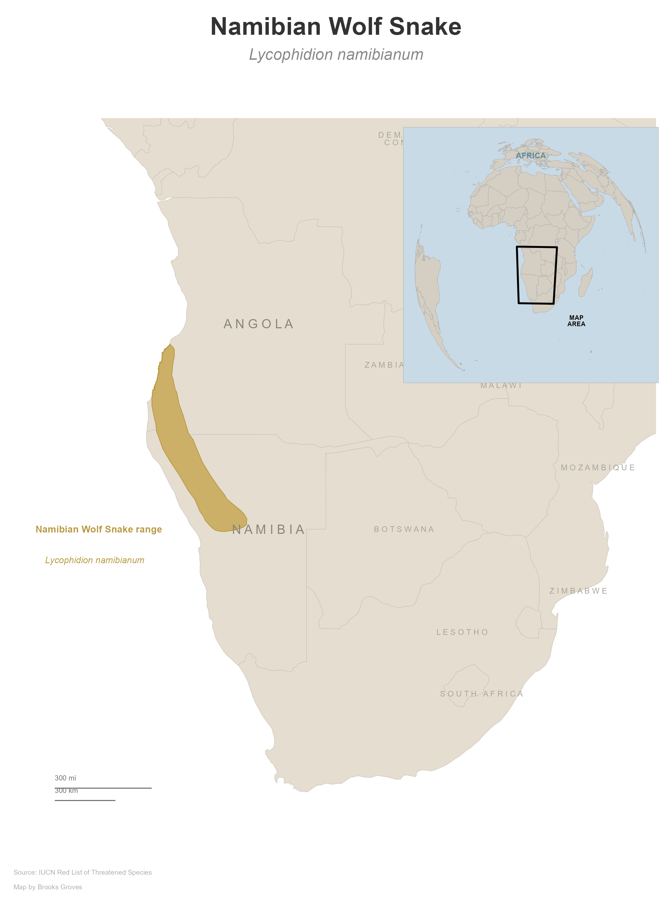

# NatGeo Style Species Maps 🗺️

Recreating the National Geographic editorial map style
using open source tools. A cartography learning project
with an automated pipeline that builds a new species
map every week.

## Maps in the Series

| # | Species | Region | Tool | Status |
|---|---------|--------|------|--------|
| 1 | Namibian Wolf Snake 🐍 | Southern Africa | QGIS | ✅ |
| 2 | Great Basin Bristlecone Pine 🌲 | Western USA | QGIS | ✅ |
| 3 | Gila Monster 🦎 | SW USA / Mexico | R | ✅ |
| 4 | Dhole 🐕 | South & SE Asia | R | ✅ Hand-crafted |
| 5 | Snow Leopard 🐆 | Central Asia | R | ✅ Auto |
| 6 | Ethiopian Wolf 🐺 | Horn of Africa | R | ✅ Auto |
| 7 | Red Panda 🐼 | Nepal to China | R | ✅ Auto |
| 8 | Kakapo 🦜 | New Zealand | R | ✅ Auto |

---

## Gallery

### Dhole — *Cuon alpinus*

> Endangered. Social pack-hunting wild dog found across
> India through Southeast Asia to the Indonesian archipelago.
> IUCN Status: EN C2a(i)

### Snow Leopard — *Panthera uncia*

> Vulnerable. Solitary big cat of the high mountains
> of Central Asia. Range spans 12 countries from
> Afghanistan to Mongolia.

### Ethiopian Wolf — *Canis simensis*

> Endangered. The world's rarest canid, found only
> in the Ethiopian highlands above 3,000m. Fewer
> than 500 adults remain.

### Red Panda — *Ailurus fulgens*

> Endangered. Arboreal mammal of the eastern Himalayas
> and southwestern China. Habitat loss and poaching
> are primary threats.

### Kakapo — *Strigops habroptila*

> Critically Endangered. Flightless nocturnal parrot
> endemic to New Zealand. One of the world's most
> intensive conservation programs with ~250 individuals.

### Gila Monster — *Heloderma suspectum*

> Near Threatened. Venomous lizard of the Sonoran
> and Chihuahuan Desert regions of the American
> Southwest and northern Mexico.

### Namibian Wolf Snake — *Lycophidion namibianum*

> Data Deficient. Endemic to Angola and Namibia
> in southern Africa.

### Great Basin Bristlecone Pine — *Pinus longaeva*

> Vulnerable. Among the oldest living organisms on Earth.
> High-elevation Great Basin ranges of the western USA.

---

## Automation Pipeline

Maps 5–8 were built automatically using a reusable
pipeline. Add a species shapefile + photo, append one
row to a CSV, and the map builds itself.

### How It Works
┌─────────────────────────────────────────────────┐
│  YOU (once per species, ~5 min)                 │
│                                                 │
│  1. Download shapefile from IUCN Red List       │
│  2. Find a CC-licensed photo on Wikimedia       │
│  3. Run add_species() → unzips, organizes,      │
│     copies photo, adds row to CSV               │
├─────────────────────────────────────────────────┤
│  PIPELINE (automatic)                           │
│                                                 │
│  4. run_queue() builds every unbuilt species    │
│  5. Auto-detects map extent from range bbox     │
│  6. Auto-detects countries in view              │
│  7. Auto-places labels at country centroids     │
│  8. Auto-calculates scale bars for latitude     │
│  9. Picks palette from CSV (6 options)          │
│ 10. Adds photo + credit to right column         │
│ 11. Exports 300 DPI PNG                         │
└─────────────────────────────────────────────────┘
Copy
### Quick Start

```r
setwd("C:/data/R_Projects/natgeo-style-species-maps")
source("R/auto/add_species.R")

# Add a new species (does everything)
add_species(
  common_name       = "Snow Leopard",
  scientific_name   = "Panthera uncia",
  zip_path          = "path/to/redlist_download.zip",
  photo_path_source = "path/to/photo.jpg",
  photo_credit      = "Photographer / Source / License",
  palette_type      = "mountain",
  continent         = "Asia",
  iucn_status       = "Vulnerable"
)

# Build all unbuilt maps
source("R/auto/generate_map.R")
run_queue()
Batch Add Multiple Species
rCopysource("R/auto/add_species.R")

batch_add(list(
  list(
    common_name = "Ethiopian Wolf",
    scientific_name = "Canis simensis",
    zip_path = "path/to/zip",
    photo_path_source = "path/to/photo.jpg",
    photo_credit = "Credit / Source / License",
    palette_type = "savanna",
    continent = "Africa",
    iucn_status = "Endangered"
  ),
  list(
    common_name = "Red Panda",
    # ... etc
  )
))

The NatGeo Style
Key design elements recreated from National Geographic
editorial species range maps:
ElementImplementationWarm parchment land#E4DDD0 — #EBE1D1 depending on regionSoft blue ocean#D6E8F0 as panel backgroundSpaced uppercase labelsCustom space_text() functionMuted range colorSpecies-specific earth tone from palette libraryLocator insetFlat WGS-84 regional context mapDual scale barsMiles + km, auto-calculated for latitudeSpecies annotationBold common name + italic scientific nameAnimal photoRight column below locator insetColumn dividerThin rule line between map and sidebarTypographyggplot2 default (Helvetica-style sans-serif)Attribution footerSource + author at 6pt

Color Palettes
Six palettes available for different habitats and regions:
PaletteRange ColorHexBest ForDesertTerracotta#D4845AArid / southwestSavannaGolden Ochre#C8A856African grasslandsJungleEarth Brown#8B6E4ETropical AsiaForestSage Green#7A9E6BTemperate woodlandMountainWarm Gray#8C7B6BAlpine / high altitudeOceanSteel Blue#5B8FA8Marine / freshwater
All palettes share the same warm parchment land fill
and soft blue ocean — only the range highlight color
and label tones change.

Lessons Learned
Orthographic Globe Insets
The original design used an orthographic globe inset
(like real NatGeo maps). This works well for Africa and
North America but causes GEOS geometry errors for
Asia-centered projections:
CopyIllegalArgumentException: Invalid number of points
in LinearRing found 2 - must be 0 or >= 4
Root cause: Country polygons crossing the orthographic
hemisphere boundary are clipped into 2–3 point slivers —
invalid LinearRings. ggplot2 defers geometry processing
to render time, so suppressWarnings() does not help.
Solution adopted: Replaced the orthographic globe with
a flat WGS-84 regional locator inset. Visually equivalent,
zero projection math, no crashes. Many real NatGeo maps
use this approach anyway.
Automation Challenges

st_bbox() returns named numeric values — st_crop()
chokes on them. Fix: unname() in auto_extent()
Some cropped country polygons have NA names —
space_text() crashes. Fix: filter(!is.na(name))
before labeling
parse() with escaped quotes inside writeLines()
is fragile. Fix: use bquote() instead
Page height must be calculated from map aspect ratio —
hardcoded values produce large white gaps

R vs QGIS for This Style
TaskRQGISScripted / reproducible✅❌Fine label placementHarderEasierGlobe insetFragileStableBatch species✅ManualPhoto inset✅ magickManualAutomation✅ GitHub Actions❌

Project Structure
Copynatgeo-style-species-maps/
│
├── .github/
│   └── workflows/
│       └── weekly_map.yml          # GitHub Actions (planned)
│
├── R/
│   ├── dhole.R                     # Hand-crafted Dhole map
│   ├── gila_monster.R              # Hand-crafted Gila Monster
│   └── auto/
│       ├── generate_map.R          # Auto map builder
│       ├── add_species.R           # Species setup helper
│       ├── post_twitter.R          # Twitter auto-post (planned)
│       └── post_bluesky.R          # Bluesky auto-post (planned)
│
├── QGIS/
│   ├── wolf_snake.qgz             # Namibian Wolf Snake
│   └── bristlecone_pine.qgz       # Bristlecone Pine
│
├── data/
│   ├── species_queue.csv           # Pipeline queue (5 species)
│   ├── Cuon.alpinus-cut.jpg        # Dhole photo
│   └── photos/
│       ├── snow_leopard.jpg
│       ├── ethiopian_wolf.jpg
│       ├── red_panda.jpg
│       └── kakapo.jpg
│
├── outputs/
│   ├── dhole_natgeo.png
│   ├── snow_leopard_natgeo.png
│   ├── ethiopian_wolf_natgeo.png
│   ├── red_panda_natgeo.png
│   ├── kakapo_natgeo.png
│   ├── gila_monster_natgeo.png
│   ├── wolf_snake_natgeo.png
│   └── bristlecone_pine_natgeo.png
│
└── README.md

Note: Species shapefiles from IUCN Red List are not
included in this repository — they are not redistributable.
Download from https://www.iucnredlist.org (free account required).


Data Sources
DataSourceLicenseSpecies rangesIUCN Red ListFree, not redistributableBase mapsNatural EarthPublic domainDhole photoDavidvraju / WikimediaCC BY-SA 4.0Snow Leopard photoBernard Landgraf / WikimediaCC BY-SA 3.0Ethiopian Wolf photoCharles J. Sharp / WikimediaCC BY-SA 4.0Red Panda photoSunuwargr / WikimediaCC BY-SA 4.0Kakapo photoDOC NZ / WikimediaCC BY 2.0

R Package Dependencies
rCopyinstall.packages(c(
  "tidyverse",          # data wrangling + ggplot2
  "sf",                 # spatial data handling
  "rnaturalearth",      # Natural Earth base maps
  "rnaturalearthdata",  # Natural Earth data files
  "cowplot",            # map composition + ggdraw
  "magick"              # animal photo inset
))

How to Reproduce
Auto Pipeline (recommended)
rCopy# 1. Download species shapefile from IUCN Red List
# 2. Find CC-licensed photo on Wikimedia Commons
# 3. Run:

setwd("path/to/natgeo-style-species-maps")
source("R/auto/add_species.R")

add_species(
  common_name       = "Species Name",
  scientific_name   = "Genus species",
  zip_path          = "path/to/iucn_download.zip",
  photo_path_source = "path/to/photo.jpg",
  photo_credit      = "Photographer / Source / License",
  palette_type      = "jungle",   # desert|savanna|jungle|forest|mountain|ocean
  continent         = "Asia",
  iucn_status       = "Endangered"
)

source("R/auto/generate_map.R")
run_queue()
Hand-Crafted Maps
rCopy# Dhole (hand-tuned labels, custom layout)
source("R/dhole.R")

# Gila Monster
source("R/gila_monster.R")
QGIS Maps
Open the .qgz project files in QGIS 3.x.
Data layers use relative paths — place shapefiles
in the same directory structure as the project.

Planned Features

 GitHub Actions weekly auto-build
 Auto-post to Twitter/X
 Auto-post to Bluesky
 Label collision detection
 Arctic + tropical palettes
 Gallery webpage from outputs folder
 Social caption templates in CSV


A personal cartography project by Brooks Groves.
Maps produced with open source tools — R and QGIS.
Pipeline automation built with ggplot2, sf, cowplot, and magick.
Add to Conversation